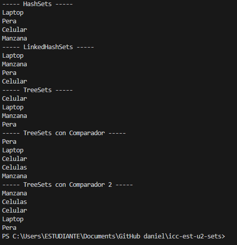
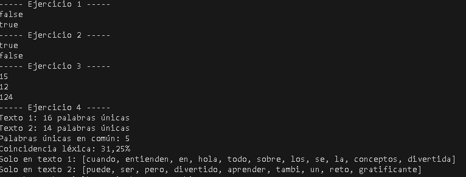

# Sets

## 📌 Información General

- **Título:** Sets
- **Asignatura:** Estructura de Datos
- **Carrera:** Computación
- **Estudiante:** Daniel Cajas
- **Fecha:** 1/07/2025
- **Profesor:** Ing. Pablo Torres

---

## 🧩 Estructura del proyecto
    src/
    │
    ├── Controllers
    │   └── Sets.java
    └── App.java
    

    ---

---
## 🧑‍💻 Ejemplo de Entrada y Salida

